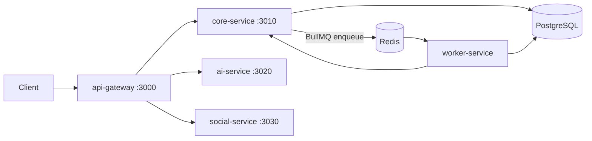
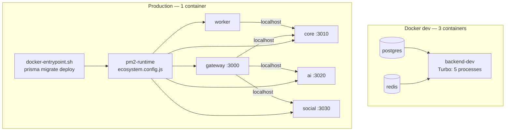
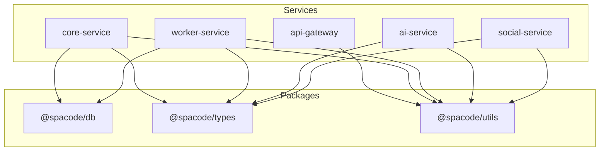

# Architecture

Marketing platform backend monorepo (`spacode-backend`). Five HTTP services share three packages; async work flows through Redis/BullMQ to a dedicated worker process.

---

## System overview

| Layer | Responsibility |
|-------|----------------|
| **api-gateway** | Public edge: CORS, rate limits, JWT verification, reverse proxy |
| **core-service** | Domain logic, auth, billing, leads, CRM, analytics, queue producers |
| **worker-service** | BullMQ consumers, cron jobs, email delivery, scoring, AI/social stubs |
| **ai-service** | AI endpoints (marketing, content, website) — stub today |
| **social-service** | OAuth callbacks, inbound webhooks, social publish — stub today |

Shared packages (`@spacode/db`, `@spacode/types`, `@spacode/utils`) hold schema, contracts, and cross-cutting utilities. Services depend on packages; packages never depend on services.

---

## Service topology



Route mounting order in the gateway matters: `aiRouter` and `socialRouter` are registered before `coreRouter` so more specific paths win.

---

## Deployment topology

The monorepo supports two container layouts. Local development without Docker uses Turbo (`pnpm dev`) the same way as inside the dev container.

| Environment | Layout | How services run |
|-------------|--------|------------------|
| **Docker dev** | 3 containers: `postgres`, `redis`, `backend-dev` | Turbo (`pnpm dev`) in `backend-dev`; bind-mount for hot reload |
| **Production / staging** | 1 container (all backend services) | `pm2-runtime` via [`ecosystem.config.js`](../ecosystem.config.js) |



**Production entrypoint** ([`docker-entrypoint.sh`](../docker-entrypoint.sh)): when `DATABASE_URL` is set, runs `prisma generate` and `prisma migrate deploy` from `@spacode/db` once before handing off to pm2. Migrations must not run per pm2 process — only in this entrypoint.

**Inter-service URLs** in the unified container use `http://localhost:<port>` (not Docker Compose hostnames). The gateway proxies to core/ai/social on localhost; the worker calls core on localhost. See [`ecosystem.config.js`](../ecosystem.config.js) and [`.env.example`](../.env.example).

**Build artifacts:** root [`Dockerfile`](../Dockerfile) (multi-stage: deps → build → runner with pm2). Dev uses [`Dockerfile.dev`](../Dockerfile.dev). Per-service Dockerfiles under `services/*/Dockerfile` are kept for optional single-service deploys only.

---

## Request lifecycle

1. **Client → gateway** — Request hits `api-gateway` on port 3000 (configurable via `PORT`).
2. **Middleware** — `requestId`, `httpLogger`, CORS; JSON body parser (except Stripe webhook).
3. **Auth (when required)** — `requireAuth` verifies RS256 JWT with `JWT_PUBLIC_KEY`, then injects headers:
   - `x-user-id` ← `payload.sub`
   - `x-org-id` ← `payload.orgId`
   - `x-system-role` ← `payload.role`
4. **Proxy** — `http-proxy-middleware` forwards to the target service URL unchanged (path + headers).
5. **Core: gateway context** — Global `gatewayContext` middleware decodes injected headers via `decodeGatewayContext`, sets `req.userId`, `req.orgId`, `req.systemRole`, and loads `req.membershipRole` when both user and org are present.
6. **Core: route middleware** — Per-router stacks add `requireAuth`, `requireBusiness`, `requireSuperAdmin`, or `parsePagination` as needed.
7. **Handler** — Thin router delegates to service module; service uses Prisma and/or enqueues BullMQ jobs.
8. **Response** — `{ success: true, data }` or `{ success: false, error: { code, message } }` via `@spacode/utils`.

### Stripe webhook special case

Stripe signature verification requires the raw request body. The gateway handles this **before** `express.json()`:

- `POST /api/v1/webhooks/stripe` uses `express.raw({ type: 'application/json', limit: '2mb' })`, `webhooksLimiter`, then proxies to core-service.
- Core mounts `stripeWebhookRouter` on the same path with its own raw body parser and verifies via `STRIPE_WEBHOOK_SECRET`.

See [`services/api-gateway/src/server.ts`](../services/api-gateway/src/server.ts) (lines 27–32) and [`services/core-service/src/modules/billing/billing.router.ts`](../services/core-service/src/modules/billing/billing.router.ts).

---

## Shared packages



| Package | Purpose |
|---------|---------|
| `@spacode/db` | Prisma client, schema, re-exported enums |
| `@spacode/types` | Queue names, job payloads, API DTOs |
| `@spacode/utils` | JWT, encryption, errors, responses, HMAC, logger |

Detail: [packages/db.md](packages/db.md), [packages/types.md](packages/types.md), [packages/utils.md](packages/utils.md).

---

## Queue architecture

Eight queues are defined in [`packages/types/src/queue.types.ts`](../packages/types/src/queue.types.ts):

| Queue | Producer(s) | Consumer | Concurrency |
|-------|-------------|----------|-------------|
| `email-send` | core-service | worker | 5 |
| `bulk-email` | core-service | worker | 2 |
| `lead-score` | core-service | worker | 10 |
| `social-publish` | (future: social-service) | worker | 3 |
| `ai-video` | (future: ai-service) | worker | 2 |
| `ai-website` | (future: ai-service) | worker | 2 |
| `google-sync` | (future: core/seo) | worker | 2 |
| `webhook-process` | (future: social-service) | worker | 5 |

**Today:** core-service produces only `lead-score`, `email-send`, and `bulk-email` via [`services/core-service/src/lib/queue.ts`](../services/core-service/src/lib/queue.ts). Worker-service consumes all eight.

Detail: [services/core-service.md](services/core-service.md), [services/worker-service.md](services/worker-service.md).

---

## Auth model

- **JWT (RS256)** — Access tokens signed with `JWT_PRIVATE_KEY`; gateway verifies with `JWT_PUBLIC_KEY`. Payload includes `sub`, `orgId`, `role`.
- **API keys** — `x-api-key` header:
  - `PUBLIC_API_KEY` — allows `POST /api/v1/leads` without JWT (`requireAuthOrPublicApiKey`).
  - `ADMIN_API_KEY` — required for legacy `/api/email` routes.
- **Super admin** — `systemRole === SUPERADMIN` (Prisma enum); enforced in core via `requireSuperAdmin` on `/api/v1/admin/*`.

Gateway never stores sessions; it only validates and forwards identity headers.

---

## Multi-tenancy

```
Organization
  └── Membership (user ↔ org, role: owner | admin | member)
  └── Business (soft-deletable)
        └── Leads, customers, SEO, social, AI jobs, CRM connections, …
```

- **Org scope** — Most authenticated routes use `req.orgId` from JWT (via gateway headers).
- **Business scope** — Business-scoped modules require `x-business-id` header (or `businessId` query / `:businessId` param). `requireBusiness` validates the business belongs to the caller's org and is not soft-deleted.
- **Plan limits** — Subscription on `Organization` gates business count and features (`lib/plan-limits.ts`).

---

## Adding a feature

1. **Types** — Add or extend DTOs / queue payloads in `@spacode/types` ([types.md](packages/types.md)).
2. **Database** — Update Prisma schema, run migration ([db.md](packages/db.md)).
3. **Core module** — Add `modules/<domain>/{router,service}.ts`; mount router in `server.ts` ([core-service.md](services/core-service.md)).
4. **Gateway route** — Wire proxy + auth + rate limiter in the appropriate `*.proxy.ts` ([api-gateway.md](services/api-gateway.md)).
5. **Async work** — If background processing is needed, define payload in types, enqueue from core (or future ai/social service), add worker in worker-service ([worker-service.md](services/worker-service.md)).
6. **Docs** — Update the relevant service/package doc and nested `AGENTS.md` when those exist.

---

## Ports and environment reference

| Service | Default port | Env var | Process type |
|---------|--------------|---------|--------------|
| api-gateway | 3000 | `PORT` | HTTP |
| core-service | 3010 | `CORE_PORT` | HTTP |
| ai-service | 3020 | `AI_PORT` | HTTP |
| social-service | 3030 | `SOCIAL_PORT` | HTTP |
| worker-service | — | — | Background (no HTTP) |

Shared infrastructure:

| Resource | Env var |
|----------|---------|
| PostgreSQL | `DATABASE_URL` |
| Redis | `REDIS_URL` |

Internal service URLs (gateway → backends; worker → core):

| Target | Env var | Default (unified container / docker-compose dev) |
|--------|---------|--------------------------------------------------|
| core-service | `CORE_SERVICE_URL` | `http://localhost:3010` |
| ai-service | `AI_SERVICE_URL` | `http://localhost:3020` |
| social-service | `SOCIAL_SERVICE_URL` | `http://localhost:3030` |

In production, all five processes share one container; only the gateway listens on the public port. Backend URLs must point at localhost, not Compose service names.

Full variable list: [`.env.example`](../.env.example). Per-service env details: service docs under [services/](services/).

---

## Service documentation index

| Service | Doc |
|---------|-----|
| api-gateway | [services/api-gateway.md](services/api-gateway.md) |
| core-service | [services/core-service.md](services/core-service.md) |
| worker-service | [services/worker-service.md](services/worker-service.md) |
| ai-service | [services/ai-service.md](services/ai-service.md) *(planned)* |
| social-service | [services/social-service.md](services/social-service.md) *(planned)* |
